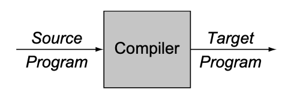

# c202-assembly

In this repository lies a C compiler written in [Elixir](https://elixir-lang.org) for the **Compilers** class at [National Autonomous University of Mexico](https://www.topuniversities.com/universities/universidad-nacional-autonoma-de-mexico-unam/undergrad) [School of Engineering](http://www.fi-a.unam.mx). 

## Hex Documentation

- [ExC Compiler](https://hex.pm/packages/exc)

## Project Development

Entire documentation:

- [Project Documentation](https://github.com/hiphoox/c202-assembly/tree/master/docs)

## Requirements

- Elixir
- Mix

## Usage

- **Clone** this repository

  ```
  git clone https://github.com/hiphoox/c202-assembly
  cd c202-assembly/exc
  ```

- **Compile** it

  ```
  mix escript.build
  ```

- **Run** it (just an example)

  ```
  ./exc examples/test.c
  ```

  <u>Note:</u> if you want to run your own C example just pass the path to that file after ```./assembly <path-to-your-file>```

- **Test** it 

  ```
  mix test
  ```

  [Set of tests for this stage](https://github.com/hiphoox/c202-assembly/tree/master/docs/testing_integration/Stage_1)

## What is a compiler?

> Compilers are computer programs that translate a program written in one language into a program written in another language
>
> ​	[Cooper, Torczon] (pg. 1)




## Light project description

In this project, we will be building a C compiler written in Elixir that compiles into x86 assembly code. The compiler will recognize the following C program structure:

```c
int main() {
  return "<exp>"; //"<exp>" will be substituted by several expressions.
}
```

The expressions the compiler will recognize are the following: 

1. **Integers**

   ```c
   int main() {
   	return 23;
   }
   ```

2. **Unary operators**

   ```c
   int main() {
     return -23; //negation (-), bitwise complement (~), logical negation (!)
   }
   ```

3. **Binary operators**

   ```c
   int main() {
     return 2 + 3; //addition (+), multiplication (*), division (/)
   }
   ```

4. **More binary operators**

   ```c
   int main() {
     return 2 && 3; //logical AND (&&), logical OR (||), equal to (==), not equal to (!=), less than (<), less than or equal to (<=), greater than (>), greater than or equal to (>=)
   }
   ```

## Statement of work

1. Teams of 4 members.
2. Everything delivered through Git and Github.
3. 30 minute working demo to the class. 

## Roles

[Néstor Martínez](https://github.com/nestorivanmoi)

- **Project manager**: sets the project schedule, holds weekly meetings, mantains a project log and makes sure the project deliverables get done on time. 

[Mario Garrido](https://github.com/mgczacki)

- **System Architect**: defines the compiler architecture, modules and interfaces. 

[Enrique Hernández](https://github.com/RickyZoneZero)

- **System Integrator**: defines the system development platforms and tools, the integration environment, and a build file to ensure the compiler components work together -> he needs to use Git correctly. 

[Alejandro Bondi](https://github.com/bondi7)

- **Tester**: defines the test plan and **AUTOMATED TESTS**. Each team member is expected to execute the test suites as the compiler is being developed to make sure the compiler meets the language specification. 

[Norberto](https://github.com/hiphoox)

- **Domain expert**: helps explain compiler concepts, characteristics, how they work and the best way to interpret them. 
- **Customer**: defines what he wants, in this specific case, the compiler features. 

## Resources

- [Nora Sandler Guide to Writing a C Compiler](https://norasandler.com)
- [Engineering a Compiler](https://www.amazon.com/Engineering-Compiler-Keith-Cooper/dp/012088478X)
- [Elixir](https://elixir-lang.org)